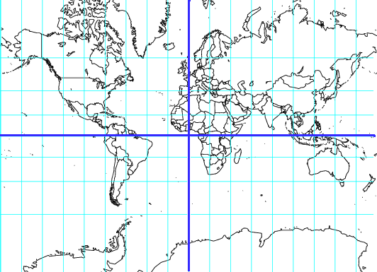
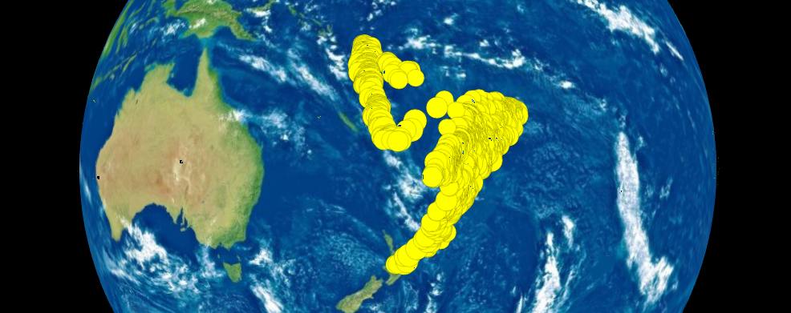
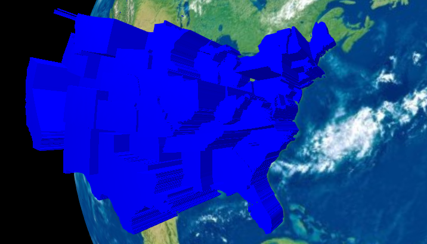
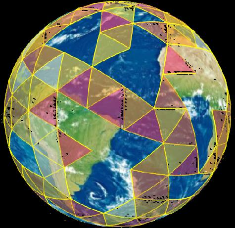

#webglobe: Interactive 3D Maps

You want to understand your data, but it's spatially distributed and you're
afraid that trying to make sense of it on something gross, like a Mercator
projection, is going to lead you to bad intuitions.

(Greenland is nowhere near that big in reality.)

webglobe can help you do this! It allows you to interactively visualize your
data on either a three-dimensional globe or a flat map.

#Example: Earth quakes

    library(webglobe)              #Load the library
    data(quakes)                   #Load up some data

    wg <- webglobe(immediate=TRUE) #Make a webglobe (should open a net browser)
    Sys.sleep(10)                     #Wait for browser to start, or it won't work
    wg + wgpoints(quakes$lat, quakes$lon, size=5*quakes$mag) #Plot quakes
    wg + wgcamcenter(-24, 178.0650, 8000)                    #Move camera

#Example: States

    library(webglobe)                 #Load the library
    m  <- ggplot2::map_data("state")  #Get data
    m$extrude_height <- 1000000*runif(nrow(m),min=0,max=1)
    wg <- webglobe(immediate=FALSE)    #Make a webglobe (should open a net browser)
    wg <- wg + wgpolygondf(m,fill="blue",alpha=1,stroke=NA)
    wg

#Example: dggridR

[dggridR](https://CRAN.R-project.org/package=dggridR) is a package for binning spatial data into equally-sized hexagonal or triangular cells. It makes spatial analysis and statistics easier by solving the problem of having to worry about whether your projection is appropriate for the region you are using: all cells have the same area. It also works well with webglobe!

    library(dggridR)
    library(dplyr)
    library(webglobe)
    library(colorspace)

    #Construct a global grid with cells approximately 1000 miles across
    dggs          <- dgconstruct(type="ISEA4T",spacing=1000, metric=FALSE, resround='down')

    #Load included test data set
    data(dgquakes)

    #Get the corresponding grid cells for each earthquake epicenter (lat-long pair)
    dgquakes$cell <- dgtransform(dggs,dgquakes$lat,dgquakes$lon)

    #Get the number of earthquakes in each cell
    quakecounts   <- dgquakes %>% group_by(cell) %>% summarise(count=n())

    #Get the grid cell boundaries for cells which had quakes
    grid          <- dgcellstogrid(dggs,quakecounts$cell,frame=TRUE,wrapcells=TRUE)

    #Update the grid cells' properties to include the number of earthquakes
    #in each cell
    grid          <- merge(grid,quakecounts,by.x="Name",by.y="cell")

    #Make adjustments so the output is more visually interesting
    grid$count    <- log(grid$count)
    cutoff        <- quantile(grid$count,0.9)
    grid          <- grid %>% mutate(count=ifelse(count>cutoff,cutoff,count))

    #Generate fill values based on quantiles of number quakes
    grid$fill     <- cut(grid$count, breaks=quantile(grid$count, seq(0,1,by=0.2)), labels=heat_hcl(5), include.lowest=TRUE)

    #Construct a webglobe
    wg            <- webglobe(immediate=FALSE)
    wg            <- wg + wgpolygondf(grid, alpha=0.6)
    wg

#Modes

webglobes have two modes: **immediate** and **not-immediate**. Immediate mode
displays a webglobe upon initialization and immediately prints all commands to
that globe. Not-immediate mode stores commands and displays them all at once,
allowing you to stage visualization without intermediate display. The difference
is illustrated below.

Display timing in intermediate mode:

    library(webglobe)
    data(quakes)                     #Get data
    q   <- quakes                    #Alias data
    wgi <- webglobe(immediate=TRUE)  #Webglobe is displayed now
    Sys.sleep(10)                    #Ensure webglobe runs before continuing
    wgi + wgpoints( q$lat,  q$lon)    #Data displays now!
    wgi + wgpoints(-q$lat, -q$lon)    #Data displays now!
    #Reloading the browser window clears everything

Display timing in not-intermediate mode:

    library(webglobe)
    data(quakes)                                  #Get data
    q   <- quakes                                 #Alias data
    wgn <- webglobe(immediate=FALSE)              #Webglobe is not displayed
    Sys.sleep(0)                                  #No need to wait
    #Note that we have to store commands
    wgn <- wgn + wgpoints( q$lat,  q$lon)         #Nothing shown yet
    wgn <- wgn + wgpoints(-q$lat, -q$lon)         #Nothing shown yet
    wgn <- wgn + wgcamcenter(2.89,-175.962,21460) #Nothing shown yet
    wgn                                           #Show it all now!
    #Reloading the browser window keeps everything

You can also switch between modes:

    library(webglobe)
    data(quakes)                                  #Get data
    q   <- quakes                                 #Alias data
    wgn <- webglobe(immediate=FALSE)              #Webglobe is not displayed
    Sys.sleep(0)                                  #No need to wait
    #Note that we have to store commands
    wgn <- wgn + wgpoints( q$lat,  q$lon)         #Nothing shown yet
    wgn <- wgn + wgpoints(-q$lat, -q$lon)         #Nothing shown yet
    wgn <- wgn + wgcamcenter(2.89,-175.962,21460) #Nothing shown yet
    wgn + wgimmediate()                           #Make it all immediate
    wgn
    wgn + wgpoints(q$lat, -q$lon)                 #This is shown right away
    #Reloading the browser window keeps everything up to `wgimmediate()`

#Roadmap

* Additional graphics primitives

* Submission to CRAN

#Credits

This R package was developed by Richard Barnes (http://rbarnes.org).

It uses the Cesium WebGL virtual globe and map engine ([link](https://cesiumjs.org/)).
